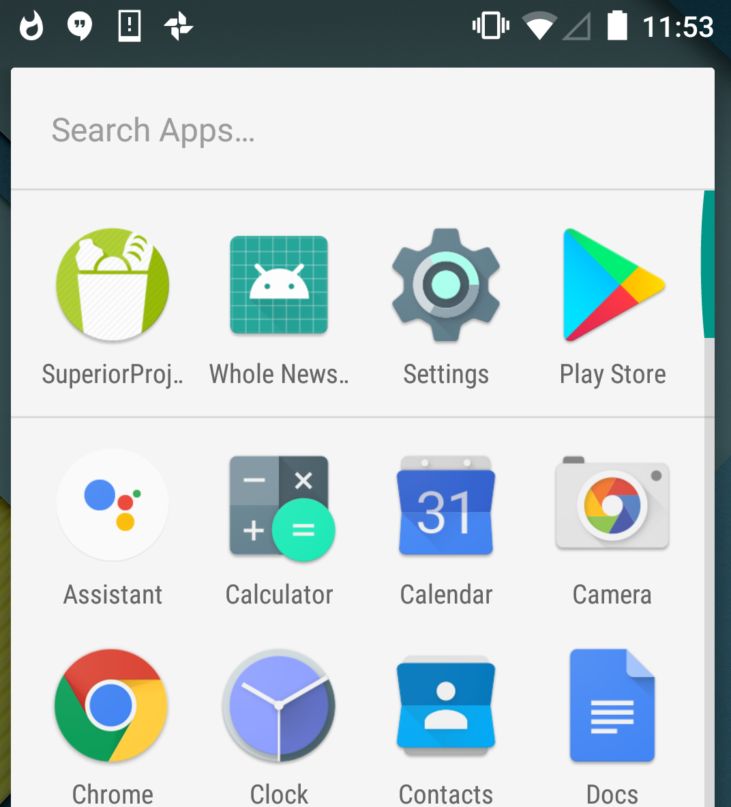
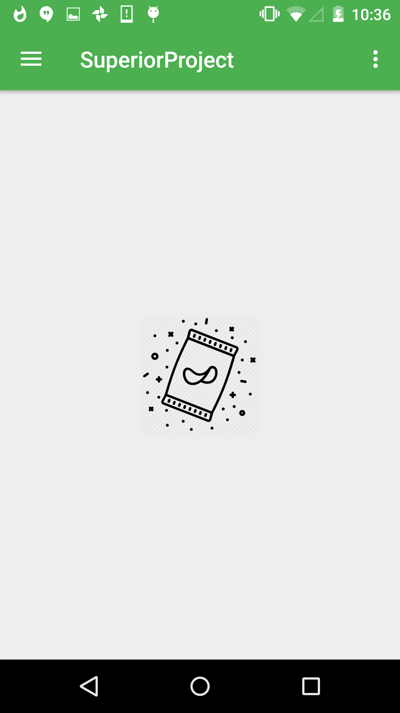
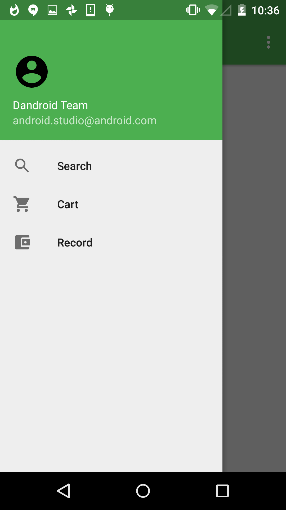
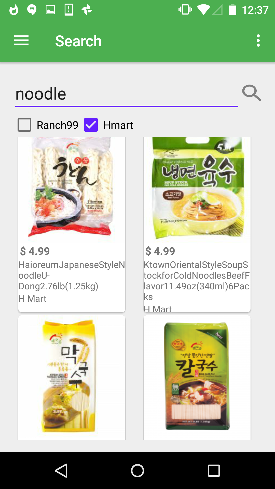

# About my project
It is android studio project, called smart grocery shopping app. Users can compare the price of similar products from different grocery stores and they also can add their favorite products into shopping list, keeping track of their spending.

# What Our team do
	Doing web crawler from two supermarkets
	Displaying products information based on users' choice 
	Achieving shopping cart CRUD operation 
	Bookeeping and make a record for users' spending

